# 🛡️ Awesome AI Safety Firewall

  

  
  
  
  
  

---

## 🚀 Top AI Safety Firewall & Guardrails Ecosystem

A curated list of **SaaS products**, **enterprise solutions**, and **open-source GitHub projects** for **AI Safety Firewalls**, **LLM Guardrails**, **Prompt Injection Defenses**, **Jailbreak Detection**, **PII Redaction**, and **Runtime AI Security**.

> **Last updated: September 2026** 📅

AI Safety Firewalls sit between applications and Large Language Models (LLMs) or autonomous AI agents to inspect inputs/outputs, neutralize malicious prompt injections, enforce corporate safety policies, mitigate PII leakage, and audit model behavior at runtime.

---

## 📑 Table of Contents
- [🌐 Market Overview](#-market-overview)
- [🏢 SaaS & Enterprise Platforms](#-saas--enterprise-platforms)
- [💻 Open-Source GitHub Projects](#-open-source-github-projects)
- [🤝 How to Contribute](#-how-to-contribute)
- [💖 Support](#-support)
- [📈 Star History](#-star-history)
- [⚠️ Disclaimer](#%EF%B8%8F-disclaimer)

---

## 🌐 Market Overview

> **Market Size & Structure**: The global **AI Safety & LLM Firewall Security Sector** is estimated at **$1.8B–$2.5B in 2026** and is growing at over 45% CAGR driven by enterprise adoption of agentic workflows.  
> **Market Dynamics**: The market is **moderately fragmented** with active consolidation. Leading cybersecurity giants (Check Point, Palo Alto Networks, Cisco, F5, Coralogix) are aggressively acquiring early specialized pioneers (Lakera, Protect AI, Robust Intelligence, CalypsoAI, Aporia).

---

## 🏢 SaaS & Enterprise Platforms

| Platform | Enterprise Valuation / Funding | Starting Paid Tier Pricing | Free Tier / Free Trial Limits | Key Capabilities |
| :--- | :--- | :--- | :--- | :--- |
| **[Protect AI](https://protectai.com/)** | **~$700M** *(Acquired by Palo Alto Networks)* | $1,500/month *(Enterprise tier)* | Request Demo / 14-day Enterprise Trial upon approval | Full MLSecOps security stack, model scanning, and runtime prompt firewalls |
| **[HiddenLayer](https://hiddenlayer.com/)** | **~$383M** *($156M Total Funding)* | $2,000/month *(Platform base)* | Request Demo / 14-day Managed Sandbox | AISec Platform detecting prompt injection, model tampering, and data exfiltration |
| **[Lakera Guard](https://www.lakera.ai/)** | **~$300M** *(Acquired by Check Point)* | $250/month *(Pro tier)* | **Free Forever**: 10,000 requests/month (8k token max prompt size) | Real-time prompt injection, jailbreak defense, and policy enforcement API |
| **[CalypsoAI](https://calypsoai.com/)** | **~$180M** *(Acquired by F5)* | $1,200/month *(Organization starter)* | Request Demo / 14-day Guided Trial | Model governance, real-time input/output scanning, and enterprise policy controls |
| **[Patronus AI](https://www.patronus.ai/)** | **~$442M Est.** *($70M Total Funding)* | $1,000/month *(Developer tier)* | Free Trial: 14 days / 5,000 evaluation test runs | Automated adversarial testing, score-based safety guardrails, and hallucination detection |
| **[Robust Intelligence](https://robustintelligence.com/)** | **~$400M** *(Acquired by Cisco)* | $2,500/month *(Enterprise suite)* | Request Demo / 30-day Proof of Concept (PoC) | Continuous AI risk management, automated red-teaming, and real-time model protection |
| **[Arthur Shield](https://www.arthur.ai/)** | **~$200M Est.** *($66M Total Funding)* | $500/month *(Starter deployment)* | Free Tier: Up to 1,000 API calls/month | Model monitoring, real-time LLM firewall for hallucination & toxicity prevention |
| **[Fiddler AI](https://www.fiddler.ai/)** | **~$200M+ Est.** *($100M+ Total Funding)* | $800/month *(Growth plan)* | Free Trial: 30-day trial with 25,000 model transactions | AI Observability, LLM guardrails, PII masking, and explainability analytics |
| **[Aporia](https://www.aporia.com/)** | **~$50M** *(Acquired by Coralogix)* | $300/month *(Starter tier)* | Free Tier: Up to 5,000 free token inspections/month | Real-time AI guardrails, latency-optimized output filtering, and observability |

---

## 💻 Open-Source GitHub Projects

Sorted by GitHub_Stars 🌟 (Descending).

- **[NVIDIA/garak](https://github.com/NVIDIA/garak)**   
  *LLM vulnerability scanner and red-teaming framework that discovers prompt injection vulnerabilities, jailbreaks, and failure modes.*

- **[promptfoo/promptfoo](https://github.com/promptfoo/promptfoo)**   
  *CLI and library for evaluating LLM security, automated red-teaming, jailbreak testing, and CI/CD assertion checks.*

- **[guardrails-ai/guardrails](https://github.com/guardrails-ai/guardrails)**   
  *Leading open-source framework for declarative validation, structured output enforcement, and corrective actions on LLM inputs/outputs.*

- **[NVIDIA/NeMo-Guardrails](https://github.com/NVIDIA/NeMo-Guardrails)**   
  *Programmable guardrails framework for controlling LLM and agent behavior, topical boundaries, dialog flow, and safety policies.*

- **[meta-llama/PurpleLlama](https://github.com/meta-llama/PurpleLlama)**   
  *Meta's open-source cybersecurity and safety evaluation tools, including **LlamaFirewall** for agent safety, prompt injection detection, and code execution scanning.*

- **[protectai/llm-guard](https://github.com/protectai/llm-guard)**   
  *Comprehensive Security Toolkit for Scanning & Sanitizing LLM Inputs and Outputs (Prompt Injection, PII, Secrets, Toxicity).*

- **[protectai/rebuff](https://github.com/protectai/rebuff)**   
  *Designed to detect prompt injection attacks in AI applications using multi-layered defense (heuristics, vector DB, LLM detection).*

- **[akshaymagapu/aisafeguard](https://github.com/akshaymagapu/aisafeguard)**   
  *Open safety proxy layer with prompt-injection detection, PII redaction, toxicity filtering, and OpenAI-compatible endpoints.*

---

## 🤝 How to Contribute

Contributions are welcome! Please follow these simple steps:

1. 🍴 **Fork** the repository.
2. 📝 **Add/Edit** entries in `README.md` maintaining standard markdown table or bullet formatting.
3. 🔍 Provide accurate descriptions, verifiable Stars_Counts/links, or pricing data.
4. 🚀 Open a **Pull Request (PR)** with a summary of changes.

---

## 💖 Support

If you find this repository helpful, please consider supporting the project:

- ⭐ **Star** this repository to increase visibility!
- 🔀 **Fork** it to keep your own curated reference.
- 📢 **Share** it with your fellow AI security engineers and developers.
- ☕ Buy me a coffee via the [GitHub Sponsors Dashboard](https://github.com/sponsors/ishandutta2007).

Thank you for helping build a safer AI ecosystem! 🙌

---

## 📈 Star History

---

## ⚠️ Disclaimer

- This is a **community-curated list** provided for educational and research purposes.
- AI Safety Firewalls reduce risks but do not guarantee complete elimination of prompt injection or jailbreak attacks. Always employ defense-in-depth strategies.
- Trademarks and logos belong to their respective owners.

---

  Made with ❤️ for AI security engineers, LLM application developers, and teams shipping safe AI products.

